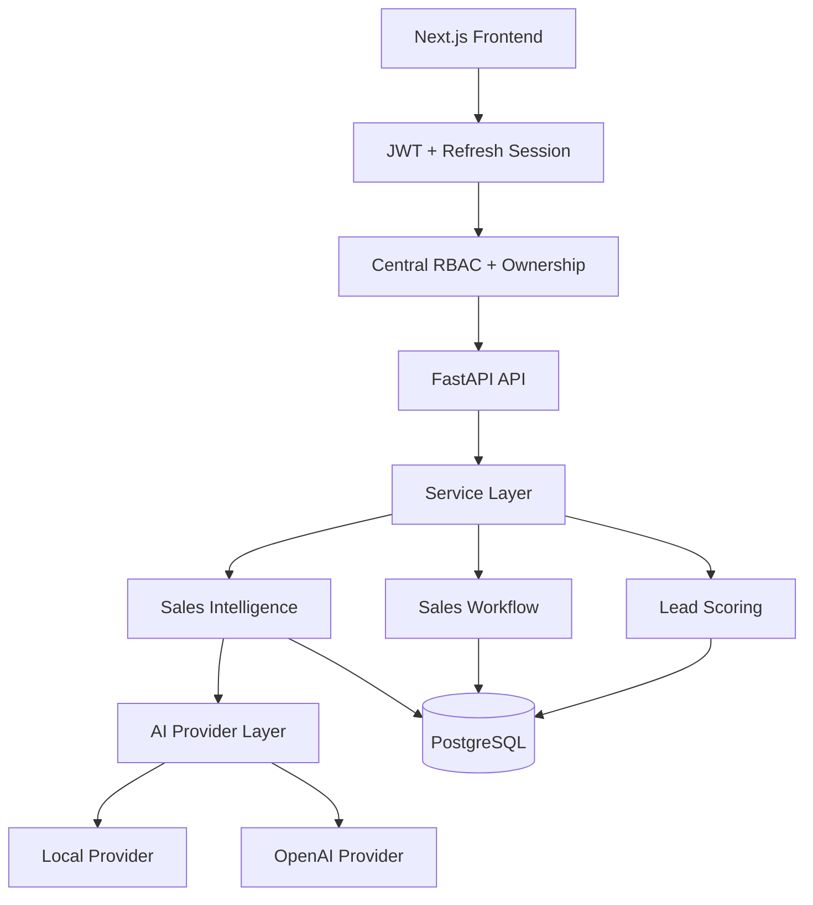

# SalesOps AI

**AI-Powered Lead Qualification & Sales Automation Platform**

SalesOps AI is a full-stack sales operations workspace that helps teams turn incoming B2B leads into clear priorities and actionable follow-ups. It combines explainable scoring, pipeline workflow, activity history, task management, analytics, and structured AI-assisted recommendations in one professional CRM-style experience.

> **Hero screenshot placeholder:** `docs/screenshots/01-dashboard.png`
> Run the documented demo reset before capturing portfolio images.

## Business Problem

Sales teams often receive leads through disconnected forms, spreadsheets, and inboxes. Qualification becomes inconsistent, promising opportunities are easy to miss, and repetitive follow-up work consumes time that should be spent selling.

## Solution

SalesOps AI stores and scores every lead with a transparent ruleset, classifies it as Hot, Warm, or Cold, and moves it through a six-stage pipeline. Its intelligence layer turns known lead, activity, and task data into buying signals, risks, a next best action, and a personalized follow-up draft. Recommendations remain advisory and reviewable by a person.

## Key Features

- Create, retrieve, update, and delete leads
- Explainable 0–100 lead scoring with Hot, Warm, and Cold classifications
- Six-stage sales pipeline: New, Qualified, Contacted, Proposal, Won, and Lost
- Automatic and manual lead activity timeline
- Follow-up tasks with priorities, lifecycle states, overdue and upcoming views
- Professional CRM-style lead detail workspace
- Structured qualification summaries, buying signals, risks, and next-best actions
- Personalized follow-up subject and message generation
- Deterministic local intelligence provider requiring no API account
- Optional OpenAI provider with structured-output validation and local fallback
- Search across lead name, company, and need
- Filter by qualification status, pipeline stage, and score range
- Pagination and safe field-based sorting
- Consistent validation and error responses
- PostgreSQL health check and structured application logging
- Alembic-managed database schema
- Automated API and scoring tests
- Responsive executive dashboard with live KPIs and Recharts visualizations
- Lead table, CRM record, pipeline board, task center, and analytics screens
- Professional loading, empty, error, validation, and action states
- Short-lived JWT authentication with rotating, revocable refresh sessions
- Centralized role-based permissions for Admin, Manager, Sales Rep, and Viewer
- Lead ownership controls and a security-relevant audit trail

## Demo Workflow

Reset the six fictional B2B scenarios, their activities and tasks, and the OrbitFlow intelligence result:

```bash
cd backend
python -m app.seed --reset --with-intelligence --with-users
```

The reset command is accepted only when `DEMO_MODE=true`. It clears the dedicated demo database and recreates only the six fictional scenarios; it never runs automatically at application startup. Keep `DEMO_MODE=false` for ordinary local development. For the portfolio walkthrough:

1. Review live KPIs and distributions on the Dashboard.
2. Open **OrbitFlow SaaS** and inspect its Hot score and Qualified stage.
3. Review its AI-assisted intelligence, buying signals, and next best action.
4. Copy the personalized follow-up and manage a follow-up task.
5. Move a lead on the Pipeline and confirm the timeline and Dashboard update.

When `--with-users` is supplied, the guarded demo seed creates four fictional accounts:

| Demo role            | Email                   |
| -------------------- | ----------------------- |
| Administrator        | `admin@salesops.demo`   |
| Sales Manager        | `manager@salesops.demo` |
| Sales Representative | `rep@salesops.demo`     |
| Viewer               | `viewer@salesops.demo`  |

Set `DEMO_ACCOUNT_PASSWORD` to an intentionally public, demo-only password before seeding and publish that password with the deployment. It is never stored in this repository, never becomes a production default, and demo-account seeding refuses to run when `DEMO_MODE=false`.

## Architecture



The HTTP layer validates input and coordinates requests. Business rules live in focused service modules. SQLAlchemy models define `Lead → Activities`, `Lead → Tasks`, and `Lead → Latest Intelligence` relationships with database-enforced cascading. Pydantic schemas define every public API and provider response. Tables are created only through Alembic migrations.

### Authentication architecture

Passwords are stored as salted `scrypt` hashes. A successful login returns a 15-minute HMAC-SHA256 access JWT that the frontend keeps only in memory. The independent opaque refresh token is stored as a SHA-256 hash in PostgreSQL and sent only through a scoped `HttpOnly` cookie. Refresh rotates and revokes the previous token; logout revokes the current token and clears the cookie. Cookie `Secure` and `SameSite` behavior, token lifetimes, and the signing secret are environment-controlled. No token or password is written to application logs.

The browser restores a session through `/auth/refresh` before rendering protected content. It does not place access or refresh credentials in `localStorage`.

### RBAC and ownership

Backend dependencies enforce permissions centrally; frontend controls are convenience only.

| Capability                                     | Admin | Sales Manager |   Sales Rep    | Viewer |
| ---------------------------------------------- | :---: | :-----------: | :------------: | :----: |
| Read sales data and intelligence               |   ✓   |       ✓       | Assigned leads |   ✓    |
| Create leads                                   |   ✓   |       ✓       |       —        |   —    |
| Edit pipeline, activities, tasks, intelligence |   ✓   |       ✓       | Assigned leads |   —    |
| Assign lead owners                             |   ✓   |       ✓       |       —        |   —    |
| Manage users                                   |   ✓   |       —       |       —        |   —    |
| Read audit logs                                |   ✓   |       ✓       |       —        |   —    |

Existing leads migrate with a nullable owner, preserving data. Admins and Managers can assign active Sales Representatives; a Sales Rep can read and mutate only leads assigned to that user. The audit log records successful login and meaningful sales/admin mutations while recursively removing sensitive metadata keys.

Authorization is evaluated in this order for the public portfolio environment:

```text
DEMO_MODE safety restrictions → Authentication → RBAC → Lead ownership
```

Consequently, even a demo Administrator cannot bypass destructive public-demo protections.

### AI provider flow

```text
Lead + Score + Pipeline + Recent Activities + Pending Tasks
                            │
                            ▼
               Sales Intelligence Service
                   ┌────────┴────────┐
                   ▼                 ▼
          Local AI Provider    OpenAI Provider
          deterministic        optional + validated
                   └────────┬────────┘
                            ▼
       Summary + Signals + Risks + Action + Follow-up
                            │
                            ▼
                Latest result persisted
```

## Tech Stack

- Python 3.12
- FastAPI and Pydantic
- SQLAlchemy 2.x and PostgreSQL 16
- Alembic migrations
- Pytest and FastAPI TestClient
- Docker Compose
- Next.js 16, React 19, and strict TypeScript
- Tailwind CSS 4 and shadcn/ui component conventions
- Recharts and Lucide icons
- Vitest and Testing Library

## Local Setup

Create and activate a Python 3.12 virtual environment, then install development dependencies:

```bash
python -m venv .venv
.venv\Scripts\Activate.ps1
pip install -r requirements-dev.txt
```

Create `.env` from `.env.example`. When running the API outside Docker, change the database hostname in `DATABASE_URL` from `db` to `localhost`.

Generate `JWT_SECRET` with at least 32 random characters. In production use HTTPS, `AUTH_COOKIE_SECURE=true`, an exact HTTPS `CORS_ORIGINS` allowlist, and an appropriate `AUTH_COOKIE_SAMESITE` value. Never reuse the documented demo password for any non-demo account.

### AI configuration

| Variable                 | Default | Purpose                                                |
| ------------------------ | ------- | ------------------------------------------------------ |
| `AI_PROVIDER`            | `local` | Select `local` or `openai`                             |
| `AI_ALLOW_FALLBACK`      | `true`  | Fall back to local intelligence after provider failure |
| `OPENAI_API_KEY`         | empty   | Optional API key; never commit it                      |
| `OPENAI_MODEL`           | empty   | Model available to your OpenAI project                 |
| `OPENAI_TIMEOUT_SECONDS` | `20`    | External provider timeout                              |

The default local provider is deterministic, explainable, and requires no network access. To opt into OpenAI, set `AI_PROVIDER=openai`, provide the API key and model through `.env`, and restart the API. The OpenAI provider uses the Responses API with a strict JSON schema, disables provider-side response storage for the request, handles timeouts/API failures/malformed output, and never logs the API key or raw request.

Apply migrations from the backend directory:

```bash
cd backend
alembic upgrade head
```

Run the API from the same directory:

```bash
uvicorn app.main:app --reload --port 8001
```

Run the frontend in a second terminal:

```bash
cd frontend
cp .env.example .env.local
npm install
npm run dev
```

`NEXT_PUBLIC_API_URL` selects the browser-facing API URL. `CORS_ORIGINS` is a required, comma-separated backend allowlist; `.env.example` uses `http://localhost:3000` for local development. `API_PORT` and `FRONTEND_PORT` configure the Docker host ports.

## Docker

1. Create your local environment file:

   ```bash
   cp .env.example .env
   ```

2. Replace the example password in `.env` and make the password in `DATABASE_URL` match.

3. Build and start PostgreSQL, FastAPI, and Next.js:

   ```bash
   docker compose up --build
   ```

The application is available at `http://localhost:3000`. The API and interactive documentation are at `http://localhost:8001` and `http://localhost:8001/docs`.

Compose applies all pending migrations before starting the API. Existing leads are preserved and assigned to the `New` pipeline stage when needed.

## API Documentation

| Method             | Path                       | Purpose                                              |
| ------------------ | -------------------------- | ---------------------------------------------------- |
| `GET`              | `/health`                  | Verify API and database connectivity                 |
| `GET`              | `/dashboard/summary`       | Read KPI and chart aggregates                        |
| `GET`              | `/leads`                   | List, search, filter, sort, and paginate leads       |
| `POST`             | `/leads`                   | Create and score a lead                              |
| `GET`              | `/leads/{id}`              | Retrieve one lead                                    |
| `GET`              | `/leads/{id}/detail`       | Retrieve lead, recent activity, and upcoming tasks   |
| `PATCH`            | `/leads/{id}`              | Update and rescore a lead                            |
| `PATCH`            | `/leads/{id}/stage`        | Transition the pipeline stage and record history     |
| `DELETE`           | `/leads/{id}`              | Delete a lead                                        |
| `POST`             | `/leads/{id}/activities`   | Add a call, email, meeting, or note                  |
| `GET`              | `/leads/{id}/activities`   | Retrieve the lead timeline                           |
| `GET`              | `/activities/{id}`         | Retrieve one activity                                |
| `POST`             | `/leads/{id}/tasks`        | Create a follow-up task                              |
| `GET`              | `/leads/{id}/tasks`        | List one lead's tasks                                |
| `GET`              | `/tasks`                   | Filter and sort tasks across leads                   |
| `GET/PATCH/DELETE` | `/tasks/{id}`              | Retrieve, update, or delete a task                   |
| `POST`             | `/tasks/{id}/complete`     | Complete a task and set `completed_at`               |
| `POST`             | `/tasks/{id}/cancel`       | Cancel a task                                        |
| `POST`             | `/leads/{id}/intelligence` | Generate or regenerate structured sales intelligence |
| `GET`              | `/leads/{id}/intelligence` | Retrieve the latest stored intelligence              |
| `POST`             | `/auth/login`              | Authenticate and start a refresh session             |
| `POST`             | `/auth/refresh`            | Rotate refresh session and issue an access token     |
| `POST`             | `/auth/logout`             | Revoke and clear the current refresh session         |
| `GET`              | `/auth/me`                 | Return the authenticated user                        |
| `GET/POST`         | `/users`                   | Admin-only user listing and creation                 |
| `PATCH`            | `/users/{id}`              | Admin-only profile, role, and status update          |
| `PATCH`            | `/leads/{id}/owner`        | Admin/Manager lead assignment                        |
| `GET`              | `/audit-logs`              | Paginated Admin/Manager audit history                |

## Testing

Tests use an isolated in-memory SQLite database and do not alter development data:

```bash
pytest
```

Frontend checks:

```bash
cd frontend
npm run lint
npm run typecheck
npm test
npm run build
```

The suites cover scoring, CRUD, pipeline transitions and history, dashboard aggregates, activities, task lifecycle, intelligence, authentication, refresh rotation/revocation, all four roles, ownership, audit logs, demo/RBAC precedence, login limiting, protected routes, current-user state, API errors, and critical rendering.

## AI Provider Architecture

Intelligence is derived only from known data: Lead profile, score, qualification status, pipeline stage, recent activities, and pending tasks. It does not invent competitors, timelines, or purchasing commitments.

The local provider considers signals such as budget, company size, AI/automation requirements, qualification score, pipeline position, overdue tasks, requirement detail, and recorded sales activity. Recommendations include an explicit reason and priority so they remain advisory and reviewable.

Example response excerpt:

```json
{
  "qualification_summary": "Hot B2B lead for OrbitFlow SaaS with a score of 90/100...",
  "buying_signals": [
    { "signal": "High budget", "evidence": "Stated budget is $9,000." }
  ],
  "risks": [],
  "next_best_action": {
    "action": "Schedule discovery call",
    "reason": "The lead is Qualified with a score of 90/100.",
    "priority": "high"
  },
  "follow_up": {
    "subject": "Next steps for OrbitFlow SaaS",
    "message": "Hi Michael, ..."
  },
  "provider": "local"
}
```

Generate and retrieve intelligence:

```bash
curl -X POST http://localhost:8001/leads/1/intelligence
curl http://localhost:8001/leads/1/intelligence
```

Regeneration updates the existing intelligence record. Only the first generation adds a timeline activity, avoiding repeated activity noise.

## Screenshot Plan

Add final portfolio captures here after starting the seeded stack:

- `docs/screenshots/01-dashboard.png` — executive KPI and chart view
- `docs/screenshots/02-leads.png` — qualified lead table
- `docs/screenshots/03-lead-detail.png` — complete CRM record
- `docs/screenshots/04-ai-intelligence.png` — AI-assisted recommendation
- `docs/screenshots/05-pipeline.png` — six-stage pipeline board
- `docs/screenshots/06-tasks.png` — follow-up task center

See [the detailed capture checklist](docs/SCREENSHOTS.md), [the case study](docs/CASE_STUDY.md), [the demo video script](docs/DEMO_VIDEO.md), and [the deployment guide](docs/DEPLOYMENT.md).

## Roadmap

- **Phase 1 — complete:** backend foundation, scoring, CRUD, PostgreSQL, migrations, tests, Docker, documentation
- **Phase 2 — complete:** sales pipeline, activity timeline, follow-up tasks, lead detail API, and demo dataset
- **Phase 3 — complete:** provider-based AI sales intelligence, explainable recommendations, follow-up generation, persistence, and fallback handling
- **Phase 4 — complete:** professional full-stack dashboard for leads, pipeline, tasks, timelines, analytics, and intelligence
- **Phase 5 — complete:** portfolio polish, CI, deployment documentation, and repeatable demo preparation
- **Phase 6 — complete:** secure authentication, centralized RBAC, lead ownership, audit controls, and role-focused demo accounts
- **Future:** multi-tenancy/workspaces, password recovery, email verification, and production observability

No paid API is required for the complete portfolio demo. No customer results or performance claims are implied.
